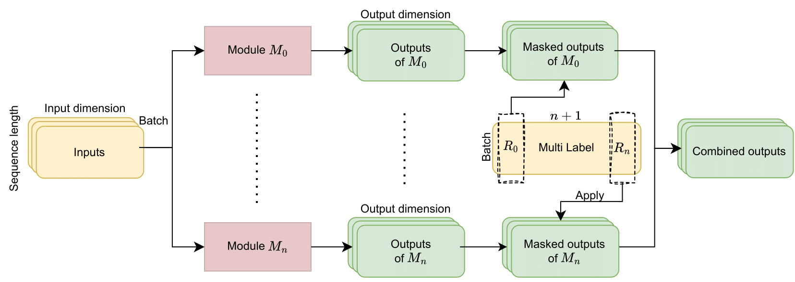

# Generating simplicial cycles
This repository provides an implementation for methods described in [`Applying language models to algebraic topology: generating simplicial cycles using multi-labeling in Wu's formula`]() by K. Brilliantov, F. Pavutnitskiy, D. Pasechnyuk, and G. Magai.

## Problem description
There is a Wu formula (J. Wu, 2001) for the homotopy groups of the two-dimensional sphere:
$$\pi_n(S^2) = \frac{R_0 \cap ... \cap R_{n-1}}{[[R_0, ..., R_n]]},$$
where $R_i = \langle x_i \rangle \subset F$ is a subgroup of free group $F$ generated by $x_i$ ( $i=1, ..., n$ ), $R_0 = \langle x_1 x_2 ... x_n \rangle \subset F$, and $[[R_0, ..., R_n]] = \Pi_{\pi \in S_n} [R_{\pi(0)}, ..., R_{\pi(n)}]$ is a symmetric commutant. Following this formula, we're trying to solve the problem of sampling elements from the homotopy group, represented by some elements of a free group $F$, which can be expressed by words in the alphabet $\{ x_1, ..., x_n, x_1^{-1}, ..., x_n^{-1} \}$, pretty comfortable object to apply computational algorithms. At the same time, sampling elements from $R_i$ (checking that element is in $R_i$) is a relatively simple procedure. It turns out to be significantly difficult to sample elements from the intersection of $R_i$'s (formula's numerator), and to check if they are in symmetric commutant (formula's denominator); there is no explicit algorithm for these problems. We propose several approximate algorithms, using a wide variety of approaches, from optimization theory and application of neural networks to NLP problems.

## Proposed approaches.
- `random-search`. We sample from incomplete intersections of $R_i$ s and test whether the sampled word is from the complete intersection.
- `evolutionary`. Using $(1+1)$-evolutionary algorithm, we search words to optimize the approximate distance to the intersection of subgroups $\Sigma_{i=0}^{n} d(x, R_i)$, where $d(x, R_i)$ is the length of the reduced word after substitution $x_i \to e$ or $x_1 \to x_{n-1}^{-1} \dots x_2^{-1}$
- `greedy`. We iteratively append generators to a word to minimize the approximate distance to the intersection of $R_i$ s.
- `language-modeling`. We train transformers to learn the intersection of distributions of $R_i$ s. We developed several training procedures based on different usages of `multi-label`. `multi-label` is a binary array of length $n + 1$ where $i$ th position denotes whether the given word is contained in $R_i$ or not.
  - `Ignore`, we model the language of the union of various incomplete intersections.
  - `Mask`, we additionally mask parts of the model during training accordingly to `multi-label`. Figure below illustrates the data flow while `Mask` training procedure.
  - `Prompt`, we model the language of words prepended with their `multi-label`s as prompts.


 
## Usage
```py
from transformers import AutoModelForCausalLM, AutoTokenizer

from freegroup.tools import (
    batch_to_string, batch_from_string,
    is_from_singleton_normal_closure
)
from typing import Dict
from freegroup.sampling import freegroup_generator
from itertools import islice
from dataclasses import dataclass

@dataclass
class InferenceConfig:
    checkpoint: str
    fdim: int
    batch_size: int
    prefix_length: int
    gen: Dict
        
config = InferenceConfig(
    checkpoint    = 'kibrq/prompt-simplical-cycles', # Load model from this checkpoint 
    fdim          = 5,  # Dimension of the Free Group
    batch_size    = 10, # Number of prefixes to generate from
    prefix_length = 5,  # Length of prefixes to generate from
    gen = {
        'max_length'          : 200,   # Maximum length of generated words
        'do_sample'           : True,  # We use sampling method to generate words
        'num_return_sequences': 5,     # Number of words per each prefix
        'top_p'               : 0.9,   # Parameter of TOP-P sampling
    }
)


tokenizer = AutoTokenizer.from_pretrained(config.checkpoint)
model = AutoModelForCausalLM.from_pretrained(config.checkpoint)

# Sample `batch_size` prefixes of length `prefix_length`
inputs = freegroup_generator(
    freegroup_dimension = config.fdim,
    length_method = 'constant',
    length_parameters = {'radius': config.prefix_length},
)

# Represent them as strings
inputs = batch_to_string(islice(inputs, config.batch_size), method = 'integer')

# Prepend them with prompt to enforce model generate from the complete intersection
prompt = 'y' * (config.fdim + 1) + ' : '
inputs = map(lambda x: prompt + x, inputs)

# Tokenize resulted strings
inputs = tokenizer(list(inputs), return_tensors = 'pt').input_ids[:, :-1]

outputs = model.generate(inputs = inputs.to(model.device), **config.gen)

# Decode outputs of the model
outputs = tokenizer.batch_decode(outputs, skip_special_tokens = True)
outputs = batch_from_string(outputs, method = 'integer')

# At this point you have list of words generated by the model.
# You can check which of them are from the complete intersection

```

## Installation
- install [`freegroup`](https://github.com/ml-in-algebraic-topology/freegroup) module
- run `python -m pip install -r requirements.txt`

## Citation
```bibtex
@article{brilliantov2023applying,
    title={Applying language models to algebraic topology: generating simplicial cycles using multi-labeling in Wu's formula},
    author={Brilliantov, Kirill and Pavutnitskiy, Fedor and Pasechnyuk, Dmitrii and Magai, German},
    journal={arXiv preprint},
    year={2023}
}
```

